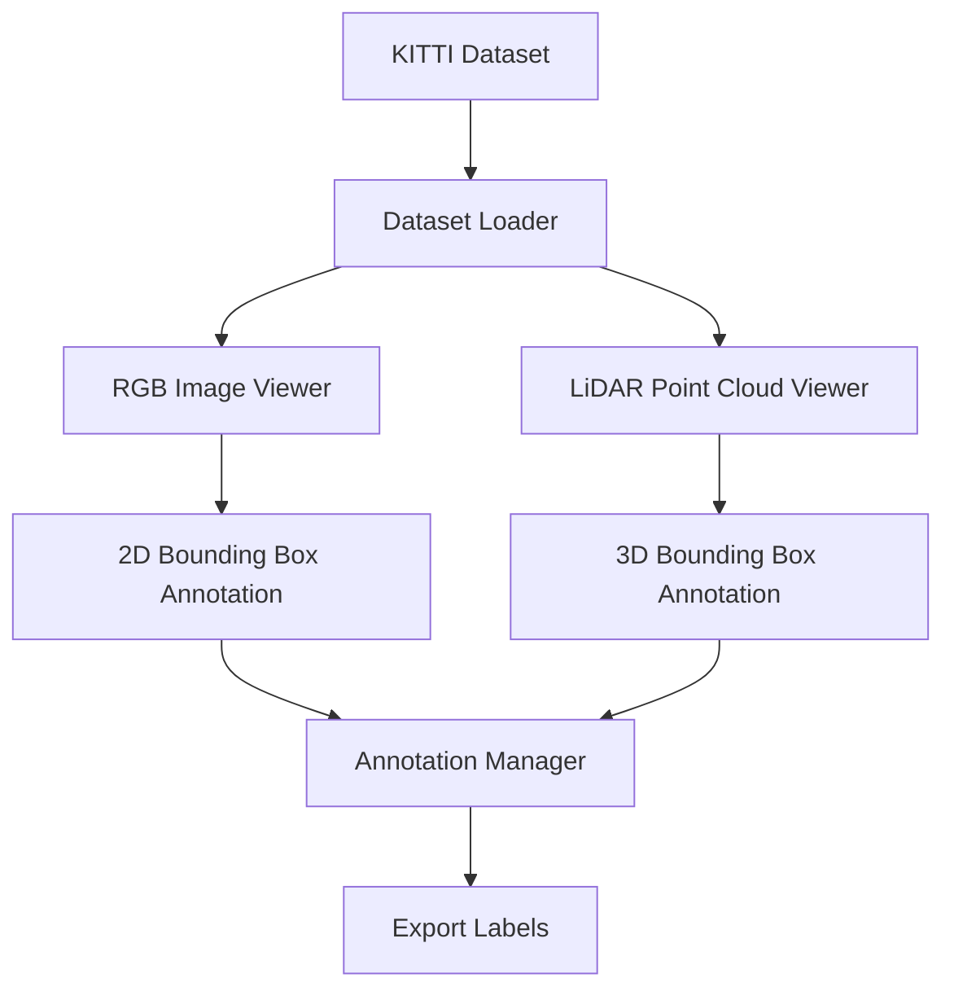

# 3D-Annotation-Tool
Developed a 3D annotation tool for KITTI autonomous driving datasets using Python, PyQt5, OpenCV, and Open3D. Implemented RGB image visualization, LiDAR point cloud processing, calibration-based projection, and annotation management to support computer vision and machine learning workflows.

# 3D KITTI Annotation Tool

A desktop application for visualizing and annotating KITTI autonomous driving datasets.

## Features

* RGB image visualization
* LiDAR point cloud visualization
* KITTI calibration support
* LiDAR point projection onto images
* Bounding box annotation
* Annotation export
* Modular PyQt5 interface

## Technologies

* Python
* PyQt5
* OpenCV
* Open3D
* NumPy

## Dataset

KITTI Vision Benchmark Suite

## Future Improvements

* 3D bounding box editing
* PointPillars integration
* Auto-annotation using deep learning
* Multi-camera support
* BEV (Bird's Eye View) visualization

# Project Workflow

## Step 1: Load KITTI Dataset

* Read RGB images from the KITTI image folder.
* Load LiDAR point clouds from Velodyne binary files.
* Parse calibration files and existing annotations.

## Step 2: Initialize Application

* Launch the PyQt5-based desktop interface.
* Create panels for image viewing, point cloud visualization, and annotation controls.

## Step 3: Visualize RGB Images

* Display camera images using OpenCV.
* Enable image navigation, zooming, and object inspection.

## Step 4: Visualize LiDAR Point Clouds

* Load and render 3D LiDAR data using Open3D.
* Allow users to rotate, zoom, and explore the point cloud scene.

## Step 5: Perform Sensor Calibration

* Read KITTI calibration matrices.
* Transform LiDAR coordinates into the camera coordinate system.

## Step 6: Project LiDAR Points onto Images

* Project 3D LiDAR points onto the RGB image plane.
* Generate synchronized visualization between camera and LiDAR sensors.

## Step 7: Create and Edit Annotations

* Select objects within the scene.
* Create, modify, and manage object annotations.
* Support common object classes such as Car, Pedestrian, and Cyclist.

## Step 8: Save Annotation Data

* Store annotation information in KITTI-compatible format.
* Maintain organized annotation files for future model training.

## Step 9: Prepare Machine Learning Dataset

* Export labeled data for computer vision and autonomous driving applications.
* Use generated annotations for object detection and sensor fusion models.

## Step 10: Future Enhancements

* Automatic object detection using deep learning models.
* 3D bounding box editing.
* Bird's Eye View (BEV) visualization.
* Semi-automatic annotation assistance.
* Multi-sensor dataset support.

# Results

* Successfully visualized KITTI RGB images and LiDAR point clouds.
* Implemented sensor fusion using calibration matrices.
* Created an annotation workflow for autonomous driving datasets.
* Generated training-ready annotations for machine learning models.

Module 1 – KITTI Data Loader: Developed a Python-based data loading module to parse KITTI RGB images, LiDAR point clouds, calibration files, and annotation labels. Implemented efficient file handling and structured data extraction to support visualization, sensor fusion, and annotation workflows.

Module 2 – RGB Image Viewer: Developed an image visualization component using PyQt5 and OpenCV to display KITTI camera frames. Implemented image loading, rendering, resizing, and GUI integration to support interactive dataset exploration.

Module 3 – LiDAR Point Cloud Viewer: Developed a 3D visualization module using Open3D to render KITTI Velodyne point clouds. Implemented point cloud loading, geometry updates, and interactive scene exploration for autonomous driving data analysis.

Module 4 – Sensor Calibration: Implemented KITTI calibration processing by parsing projection, rectification, and LiDAR-to-camera transformation matrices. Developed coordinate transformation pipelines to align LiDAR point clouds with camera reference frames for sensor fusion and visualization.

Module 5 – LiDAR-to-Camera Projection: Implemented sensor fusion by transforming LiDAR points into camera coordinates and projecting them onto RGB images using KITTI calibration matrices. Added depth-aware visualization to improve scene understanding and annotation accuracy.

Module 6 – Annotation System: Developed an interactive annotation framework supporting mouse-based bounding box creation, object class selection, annotation visualization, and structured label storage. Implemented support for common autonomous driving classes including Car, Pedestrian, and Cyclist.

Module 7 – Annotation Export: Implemented annotation export functionality for KITTI-compatible label generation. Developed structured file-writing utilities to convert user-created annotations into machine learning-ready datasets.

Module 8 – Machine Learning Assisted Annotation: Integrated a pretrained YOLO-based object detector to automatically generate object annotations from RGB images. Implemented semi-automatic labeling workflows that allow users to review, modify, and export machine learning-ready annotations.

Module 9 – Bird's Eye View Visualization: Developed a top-down LiDAR visualization module by converting point cloud data into a Bird's Eye View representation. Implemented spatial filtering and occupancy mapping to improve scene understanding and support autonomous driving annotation workflows.

Module 10 – 3D Bounding Box Annotation: Developed 3D bounding box representations for autonomous driving objects using LiDAR-derived spatial information. Implemented 3D box generation, projection onto RGB images, and visualization pipelines to support advanced object annotation and sensor fusion workflows.

Module 11 – Interactive 3D Editing: Implemented point-cloud-driven object selection and interactive 3D bounding box manipulation. Developed translation, rotation, resizing, and deletion tools with synchronized updates across RGB, LiDAR, and Bird’s Eye View visualizations.

## System Architecture

